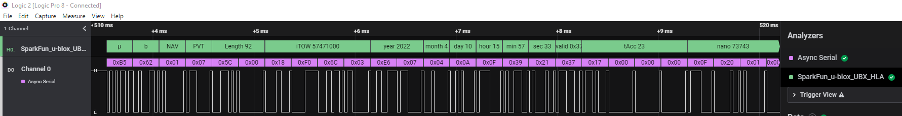
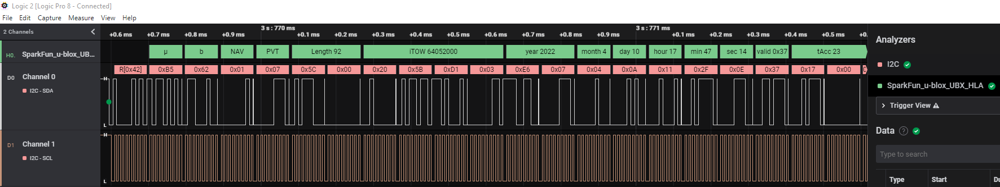
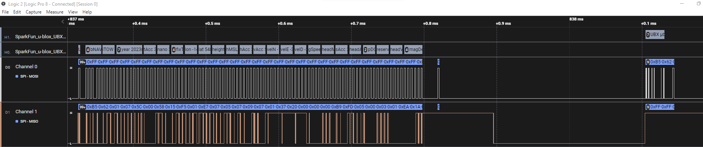

# u-blox UBX Analyzer
  
A Logic2 High Level Analyzer for the u-blox UBX protocol. Also supports NMEA and RTCM.








Written for the [Saleae Logic Pro 8 USB Logic Analyzer](https://www.sparkfun.com/products/13196):

[](https://www.sparkfun.com/products/13196)

## v1.0.3

* Bug fix: correct calls to analyze_signed in POSECEF and POSLLH

## v1.0.2

* NMEA decoding (format and checksum only).
* RTCM decoding (length, type and checksum only).
* Add SPI support:
  * Channel can be selected as miso or mosi.
  * You can add two instances of the analyzer to monitor both channels simultaneously.
* Add NAV-POSECEF and NAV-POSLLH.
* Add M8 vs. M6 module selection.
* Includes support for ```I2C_ADDRESS_SETTING```
  * Only messages to/from the selected I2C Address are decoded.
  * You can add two instances of the analyzer to monitor (e.g.) 0x42 (ZED-F9P) and 0x43 (NEO-D9S) simultaneously.
* Includes support for the u-blox register layout in I2C transfers:
  * The decoder will skip over the two Bytes-Available bytes returned from Registers 0xFD and 0xFE.
  * This prevents accidental decoding of 0xB5, '$' or 0xD3 as the start of UBX/NMEA/RTCM data.

Contributed by [@maehw](https://github.com/maehw) :

* Add support for decoding CFG-PRT, CFG-RST, CFG-MSG, MON-VER, MON-HW, NAV-STATUS and NAV-TIMEGPS messages.
  * Includes support for u-blox 6 and u-blox 8 Protocol Specifications.

## v1.0.1

* Add support for NEO-D9S: decode UBX-RXM-PMP (Versions 0 and 1); UBX-INF-NOTICE, -ERROR and -WARNING.

## v1.0.0

* Proof of concept for Async Serial (UART) and I2C traffic: demonstrates that the HLA can successfully decode UBX frames when interleaved with NMEA messages.
* Provides simple decoding of UBX frames: displays the frame class, ID, length; extracts UBX-ACK-ACK, UBX-ACK-NACK and UBX-NAV-PVT fields; validates the checksum bytes.

## Upgrade Path

* Add decoding of more message types.
* Highlight UBX, NMEA, RTCM and checksum errors in different colors. 
  * Requires a new Logic2 HLA color field feature: [please vote for it here](https://ideas.saleae.com/b/feature-requests/add-hla-color-field-to-result-type/)

## Contributing

Thank you so *much* for offering to help out. We truly appreciate it.

If you'd like to contribute, start by searching through the [issues](https://github.com/sparkfun/SparkFun_u-blox_UBX_HLA/issues) and [pull requests](https://github.com/sparkfun/SparkFun_u-blox_UBX_HLA/pulls) to see whether someone else has raised a similar idea or question.
Please check the [closed issues](https://github.com/sparkfun/SparkFun_u-blox_UBX_HLA/issues?q=is%3Aissue+is%3Aclosed)
and [closed pull requests](https://github.com/sparkfun/SparkFun_u-blox_UBX_HLA/pulls?q=is%3Apr+is%3Aclosed) too - you may find that your issue or feature has already been discussed.

If you decide to add a feature to this analyzer, please create a Pull Request and follow these best practices:

* Change as little as possible. Do not submit a PR that changes 100 lines of whitespace. Break it up into multiple PRs if necessary.
* **Important:** Please submit your PR using the [release_candidate branch](https://github.com/sparkfun/SparkFun_u-blox_UBX_HLA/tree/release_candidate). That way, we can merge and test your PR quickly without changing the _main_ branch

## License

License: MIT. Please see [LICENSE.md](./LICENSE.md) for more details.
