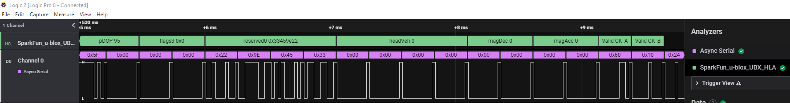

  # u-blox UBX Analyzer
  
A Logic2 High Level Analyzer for the u-blox UBX protocol

Written for the [Saleae Logic Pro 8 USB Logic Analyzer](https://www.sparkfun.com/products/13196):

## v1.0.2

Add support for decoding MON-HW, NAV-STATUS and NAV-TIMEGPS messages (according to u-blox 6 Protocol Specification).

## v1.0.1

Add support for NEO-D9S: decode UBX-RXM-PMP (Versions 0 and 1); UBX-INF-NOTICE, -ERROR and -WARNING.

## v1.0.0

Proof of concept for Async Serial (UART) and I2C traffic: demonstrates that the HLA can successfully decode UBX frames when interleaved with NMEA messages.

Provides simple decoding of UBX frames: displays the frame class, ID, length; extracts UBX-ACK-ACK, UBX-ACK-NACK and UBX-NAV-PVT fields; validates the checksum bytes.

## Upgrade Path

Add decoding of more message types.

Add proper support for the u-blox register layout and read transfers. Currently if the number of bytes in the I2C buffer is 0x62B5, the analyzer will attempt to decode that as a packet.

Add support for SPI.

Use I2C_ADDRESS_SETTING to filter messages on the selected I2C Address.